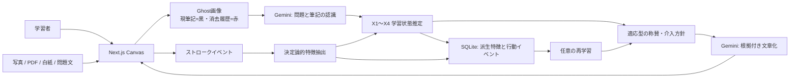

# HomeruAI システム仕様書

> 最終更新: 2026年9月  
> 対象: 開発者・研究実施者  
> 目的: 正誤ではなく、学習者が書き、消し、止まり、再開した過程を根拠に褒め、自発的な学習行動を支える。

## 1. 研究上の位置づけ

HomeruAI は採点アプリではない。最終解答だけでは失われる次の行動を時系列で保存し、称賛の根拠として扱う。

- 最初にペンを動かしたこと
- 書いた内容と、消した内容
- 消した後に同じ付近へ書き直したこと
- ペンが止まった時間と、その後に再開したこと
- 同じ領域で試行錯誤を続けたこと
- ヒントを提示したか、開いたか、その後に筆記を再開したか

重要な原則は、停止だけを「迷い」や「深い思考」と断定しないことである。ページが見えている、直前に筆記がある、停止後に再開する、といった複数の観測が揃ったときだけ根拠を強める。画像認識が不確かな場合も、筆記イベントの事実は独立して褒められる。

## 2. アーキテクチャ



AI の役割を二段階に分離する。

1. 認識段階: 問題原本と Ghost 画像から、問題、現在の式、消去された式、認識確信度を構造化して返す。
2. 文章化段階: コードで抽出済みの根拠 ID と学習状態だけを使い、3件の称賛と段階的ヒントを返す。

AI が返した称賛の根拠 ID が実在しない場合、その文章は採用しない。画面上の丸やスタンプの位置も AI に推測させず、根拠ストロークの座標からサーバー側で生成する。

## 3. 技術スタック

| 層 | 技術 |
| --- | --- |
| Frontend | Next.js 16.3.4 App Router、React 19、TypeScript、perfect-freehand |
| 文書入力 | pdfjs-dist 5、画像 File API |
| エクスポート | jsPDF、Canvas PNG |
| Backend | FastAPI 0.141.1、Pydantic 2.13.5、Uvicorn 0.52.4 |
| AI | google-genai 2.22.0、`gemini-3.5-flash-lite`、候補 `gemini-3.6-flash` |
| 保存 | IndexedDB（ノート）、SQLite（研究用の派生特徴・イベント） |
| 任意の学習 | scikit-learn の標準化ロジスティック回帰。実行時は JSON 係数のみ使用 |

外部AIプロバイダーは Gemini のみとする。認証、割当、モデル、スキーマ、タイムアウト、一時障害、ネットワークの失敗を分類し、外部AIが利用できなくてもローカルのプロセス称賛を返す。

## 4. ディレクトリ

```text
HomeruAI/
├─ backend/
│  ├─ app/
│  │  ├─ main.py              # API、サイズ制限、保存
│  │  ├─ schemas.py           # Pydantic v2 契約
│  │  ├─ analyzer.py          # Gemini二段階分析とローカルフォールバック
│  │  ├─ process_features.py  # 消去・停止・再開・反復領域の特徴抽出
│  │  ├─ learner_model.py     # X1〜X4推定と介入方針
│  │  ├─ adaptive_model.py    # 学習済みJSON係数の安全な読み込み
│  │  ├─ storage.py           # SQLite研究ストア
│  │  └─ config.py
│  ├─ scripts/
│  │  ├─ export_training_data.py
│  │  └─ train_support_model.py
│  ├─ tests/
│  ├─ requirements.txt
│  └─ requirements-ml.txt
├─ frontend/
│  └─ src/
│     ├─ app/page.tsx
│     ├─ components/
│     │  ├─ Canvas.tsx
│     │  ├─ LearningDashboard.tsx
│     │  ├─ DebugPanel.tsx
│     │  ├─ ReplayPlayer.tsx
│     │  └─ ProblemRegionSelector.tsx
│     ├─ types/canvas.ts
│     └─ utils/
│        ├─ ghostRenderer.ts
│        ├─ strokeHistory.ts
│        ├─ notebookStorage.ts
│        ├─ pdfImporter.ts
│        └─ adaptiveLearning.ts
├─ README.md
└─ SPECIFICATION.md
```

## 5. データモデル

### 5.1 Stroke

`Stroke` は描画だけでなく消去操作も一級データとして残す。

```ts
interface Stroke {
  strokeId: string;
  type: "draw" | "erase" | "pixel-erase";
  startTime: number;
  endTime: number;
  points: { x: number; y: number; p: number; t: number }[];
  color?: string;
  width?: number;
  isErased?: boolean;
  erasedAt?: number;
  targetStrokeIds?: string[];
}
```

部分消しも削られた元ストロークを `targetStrokeIds` で結び、元の試行を履歴に残す。単なる Undo と消去による自己修正は `strokeHistory.ts` で区別する。

### 5.2 ProcessMetrics / ProcessEvidence

主な派生量は次の通り。

| 特徴 | 定義 |
| --- | --- |
| stroke_count | 描画ストローク数 |
| revision_count | 消去イベント数 |
| successful_revision_count | 消去後、近い領域に描き直した回数 |
| pause_count | 履歴上で6秒以上空いた区間 |
| restart_count | 停止後に筆記を再開した回数 |
| unresolved_pause_count | まだ再開が観測できない停止候補 |
| repeated_region_count | 同じ領域に戻って修正した回数 |
| active_writing_seconds | 実筆記時間 |
| session_seconds | 最初から最後までの経過時間 |

各称賛候補は `ProcessEvidence` として `evidence_id`、説明、時間、ストローク ID、領域を持つ。これにより「褒めた理由」を検証できる。

### 5.3 学習者状態 X1〜X4

値域はすべて 0〜1。人格や固定能力の判定ではなく、その端末で観測した最近の学習行動に基づく暫定推定である。

| 変数 | 意味 | 主な正の要因 | 主な負の要因 |
| --- | --- | --- | --- |
| X1 mastery | 現課題に対する身につき | 認識した進捗、成功した自己修正 | 問題難度との差、低確信認識は重みを下げる |
| X2 autonomous_engagement | 自分で進める傾向 | 筆記継続、停止後の再開、ヒントなしの進行 | ヒント依存、未解決停止 |
| X3 support_need | 今必要な支援量 | 長い未解決停止、同領域の反復、難度差 | 自力再開、高い X1・X2 |
| X4 persistence | 粘り強さ | セッション継続、再開、自己修正 | 観測不足時は中立値へ寄せる |

初回は説明可能なルールで推定し、分析のたびに過去状態へゆっくり統合する。断定を避けるため `confidence` と `reasons` を返す。

### 5.4 適応型介入

介入は `wait`、`micro_praise`、`offer_hint`、`metacognitive_question`、`challenge` のいずれか。

- X1 が低く X3 が高い: ペンを動かしたこと自体を褒め、15秒以降に小さなヒントを選べるようにする。
- X1 が上がり X2 がまだ低い: すぐに答えを見せず、「次に使えそうな関係は？」などのメタ認知質問を増やす。
- X1・X2 が高い: 待つ時間を長くし、自力達成を妨げない。必要なら発展課題を示す。
- タブが非表示: 停止を迷いとみなさず `wait` にする。

ヒントは最大3段階で、方向づけ、着目点、具体化の順に開示する。開かなかった選択も研究データになる。

## 6. 任意問題への対応

- 白紙へ問題と解答を手書き
- 問題文をテキスト入力し、キャンバスへ配置
- 写真・画像を配置してその上へ筆記
- PDF を最大30ページまで読み込み、1 PDFページを1ノートページへ変換
- 複数問題を含む画像は「問題範囲」でドラッグ選択し、選択範囲だけを送信

問題原本画像と、現在筆記＋赤い消去履歴の Ghost 画像は別画像として認識段階へ渡す。問題原本は最大辺1600pxへ縮小し、選択範囲がある場合はブラウザで切り出す。

## 7. API

### POST `/api/analyze`

必須: `questionId`、1件以上の `strokes`、Ghost `image`。任意で `questionText`、`sourceImage`、`sourceType`、`analysisBounds`、`learnerId`、`sessionId`、`problemDifficulty`、`hintCount`、`feedbackCondition` を受け取る。`feedbackCondition=neutral_summary` は研究比較用で、称賛・赤ペン・途中介入を行わず観測事実を評価語なしで要約する。

応答には `praise_points`、`praise_evidence`、`recognized_content`、`recognition_confidence`、`process_metrics`、`process_evidence`、`learner_state`、`intervention`、`source`、`provider_error_category`、`notice` を含む。

### POST `/api/assist`

画像を送らない高速な停止時判断。ストローク、現在の無操作秒数、ページ表示状態、ヒント利用回数から介入を返す。フロントエンドは15秒以降、10秒以上の間隔を空けて評価する。

### POST `/api/events`

`session_started`、`intervention_offered`、`intervention_dismissed`、`hint_opened`、`writing_resumed`、`analysis_completed`、`feedback_rating` などを記録する。

### GET `/api/learners/{learner_id}/state`

擬似匿名化された学習者の現在状態とサンプル数を返す。

### GET `/api/learners/{learner_id}/dashboard`

X1〜X4の現在値、分析履歴、学習回数、筆記・書き直し・再開回数、継続日数、実績、レベルとXPを返す。X1〜X4は課題によって上下する推定値だが、努力の蓄積として表示するXPは減らない。

### GET `/api/health`

Gemini設定、構造化出力スキーマ互換性、ローカルフォールバック、研究ストアの状態を返す。

## 8. UI・入力品質・デバッグ

- 常設の成長バーは、そのページでペンを動かした本数、現在レベル、累積XPを表示する。
- 学習者向けダッシュボードは、習得度、自分で進める力、粘り強さ、見守り度をやさしい言葉で示す。固定能力や他者との順位としては表示しない。
- 研究者向け Debug パネルは、X1〜X4、生のプロセス特徴、認識確信度、分析元、Gemini失敗分類を確認できる。
- Pointer Events の `pointerType`、筆圧、傾き、接触幅、合成イベント数を Debug パネルで確認できる。Apple Pencil入力中の指接触は描画終了として扱わず、パームリジェクションとして無視する。
- `getCoalescedEvents()` が利用できる環境では、そのサンプルを筆跡へ取り込み、高速なPencil入力の欠落を減らす。
- 丸・下線・花丸は根拠IDごとに一つだけ描き、称賛文はキャンバス上へ重ねず称賛カードへ分離する。過去保存データに重複があってもフロントエンドで重複描画を防ぐ。
- 称賛は固定能力・人格ラベルと誇張を避け、「観測した行動→学習上の意味」を具体的に伝え、次の行動の選択を本人へ残す。

## 9. 障害時の挙動

Gemini 呼び出しにはタイムアウトを設定する。主モデルの一時障害・割当制限・モデル不在では候補モデルを試す。認証や構造化出力の不整合は繰り返しても改善しないため再試行せず、即座にローカル分析へ移行する。

認識だけ成功して文章化に失敗した場合は `hybrid` とし、認識結果とコード生成の称賛を返す。両方使えない場合も、記録された行動を根拠とする3件の称賛を返す。外部AIの失敗文を学習者向けの称賛に混ぜない。

## 10. 研究データとプライバシー

通常利用ではブラウザの学習者 ID とセッション ID をランダム生成する。実験では参加者コードから `study_CODE` を学習者 ID にし、コード単位でデータを照合できるようにする。サーバーではこれらを SHA-256 の短縮ハッシュへ変換する。SQLite には派生特徴、学習状態、介入、反応、処理時間を保存する。

サーバー研究ストアには問題画像、Ghost画像、生のストローク点列、APIキーやトークンを保存しない。一方、端末内の IndexedDB には生の筆跡を含むノートが残り、Gemini利用時には解答画像が外部APIへ送られる。実験開始前に同意文、撤回・削除手順、保存期間、研究責任者、倫理審査要否を別途定めること。現実の児童生徒を対象にする場合、擬似匿名化だけで匿名化済みとは扱わない。

## 11. 再学習設計

最初から境界値をブラックボックス学習へ委ねない。研究初期はルール版を固定し、各介入に対する反応を収集する。

主な教師信号:

- 正: ヒントを開いた後または介入後5分以内に筆記を再開
- 補助正: 称賛を「役立った」と評価、次の問題へ進む
- 負: 明示的に閉じる、または「少し違った」と評価する

後続イベントがない介入は、ブラウザを閉じただけかもしれないため負例にしない。

`train_support_model.py` は `intervention_offered` と後続イベントを結び、最低30件かつ2クラス以上でロジスティック回帰を学習する。学習者が3人以上なら learner 単位の GroupKFold を使い、同じ人が訓練と評価へ混ざるリークを避ける。出力 JSON は係数、標準化量、指標、制約を含み、`adaptive_model.py` がルール予測と 65:35 で混合する。

観察データでは「介入した場合」の結果しか見えないため、将来の比較実験では同意済みの範囲で介入確率を記録し、ルール版対適応版、または安全な範囲のランダム化を行う。正解率だけでなく、自発的再開率、ヒントなし継続時間、次問移行率、再訪率を主要指標とする。

## 12. 起動と検証

### Backend

```powershell
cd backend
py -3.13 -m venv venv
.\venv\Scripts\Activate.ps1
pip install -r requirements.txt
Copy-Item .env.example .env
# .env の GEMINI_API_KEY を設定
python -m uvicorn app.main:app --reload --port 8000
```

APIキーがなくてもプロセス分析のローカル版は動作する。

### Frontend

```powershell
cd frontend
npm install
npm run dev
```

ブラウザで `http://localhost:3000` を開く。

### テスト

```powershell
backend\venv\Scripts\python.exe -m unittest discover -s backend\tests -v
cd frontend
npm run lint
npm run build
```

### データ出力と再学習

```powershell
backend\venv\Scripts\python.exe backend\scripts\export_training_data.py
backend\venv\Scripts\python.exe backend\scripts\export_study_events.py --participant-code P001
backend\venv\Scripts\python.exe -m pip install -r backend\requirements-ml.txt
backend\venv\Scripts\python.exe backend\scripts\train_support_model.py
```

ローカル開発の既定 SQLite は `backend/data/homeruai.db`。Vercel では消えるローカルファイルを使わず、`TURSO_DATABASE_URL` と `TURSO_AUTH_TOKEN` で Turso の libSQL に接続する。研究用の監査・出力・再学習・撤回スクリプトも同じ環境変数を参照し、`--database` を指定した場合はそのローカル SQLite に切り替わる。公開手順は [`VERCEL_DEPLOYMENT.md`](./VERCEL_DEPLOYMENT.md) を参照。再学習モデルは `backend/models/support_policy.json` で Git 管理外である。

## 12. 実装済みと次の研究課題

実装済み:

- 消去対象 ID と時刻を含むストローク履歴、部分消し、Undo、タイムラプス
- Ghost Rendering、問題原本との二画像分析
- 停止、再開、成功した書き直し、同領域反復の決定論的抽出
- Gemini 構造化認識と根拠付き称賛、失敗分類、ローカルフォールバック
- 写真、PDF、白紙、テキスト問題、問題範囲切り出し
- X1〜X4 状態推定、段階的ヒント、リアルタイム介入
- IndexedDB 自動保存、擬似匿名イベント、SQLite保存、CSV出力、任意再学習
- 成人向けの難度別デモ7問と、外部アンケート用のプロセス称賛／中立フィードバック比較条件
- URLで外部切り替えする実験モード（固定3問＋固定の任意追加1問、参加者別進捗保存、自由操作の制限、完了画面）
- 実験の初筆記時間・無筆記スキップ・フィードバック提示の記録、未送信ログの端末内キューと再送、完了時の送信状態表示
- セット内で条件を均衡させる割付CSV、参加者別イベント監査CSV、端末とサーバーの参加者別撤回処理

成人予備実験の対象、先行研究、外部アンケート項目、A/B実施URL、分析計画、研究上の限界は [`RESEARCH_PROTOCOL.md`](./RESEARCH_PROTOCOL.md) を参照する。アンケートや同意フォームはアプリ内に実装せず、研究責任者情報と撤回方法を含む外部フォームで実施する。

研究用のプロトコル版は `adult-pilot-v1.2`。実験イベントのペイロードと割付CSVに保存する。実験画面は通常ノートの描画リボン・進行欄・問題一覧・称賛表示に寄せ、問題選択など研究上不要な操作のみ制限する。称賛条件は花丸・赤ペンを含み、比較条件は事実要約のみとするため、文面単体ではなく視覚表現を含む称賛体験の比較である。`backend/scripts/create_experiment_assignments.py` で割付、`backend/scripts/audit_experiment.py` で欠損・条件不一致・分析元を監査する。端末の撤回は同じブラウザで `/research/cleanup`、サーバーの撤回は `backend/scripts/withdraw_participant.py` を使う。CSV出力・バックアップ・外部アンケートは別途消去が必要。

研究前に追加検討する項目:

- 問題難度を教員が入力・校正するUI
- 学習者本人に状態推定の説明・オプトアウト・データ削除を提供
- 教員用の集約画面（個人の監視ではなく介入設計の評価を目的とする）
- 数学以外の教科での認識評価セット
- 介入なし対照を含む事前登録済み実験、校正誤差、公平性、長期的な自発学習への効果測定

## 13. 設計上の禁止事項

- 停止だけを根拠に「迷っている」「理解していない」と断定しない。
- 能力値を成績や人格ラベルとして学習者へ提示しない。
- 消去を失敗として罰しない。書き直し・検証の可能性として扱う。
- 認識確信度が低い内容を正誤判定へ強く使わない。
- 学習データが少ない段階で、機械学習モデルだけに介入判断を任せない。
- 生画像、生の筆跡、秘密情報を研究イベントへ保存しない。
